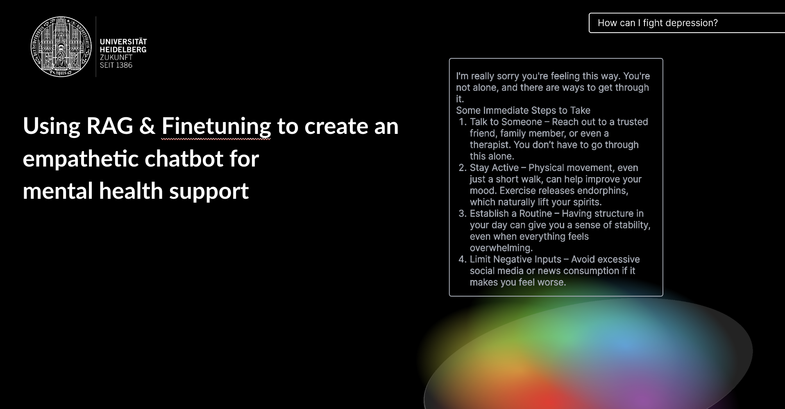

# MentalAI 


MentalAI is a retrieval-augmented system for mental health support with fine-tuned suicide prediction. It leverages **llama.cpp**, reverse engineered **GPT2** and **LangChain** to provide AI-assisted conversations based on retrieved contextual information. The overall idea is to combine clinical expert knowledge with empathy and therapeutical experience by combining finetuned emotion and suicidality classifiers with academic, therapeutic and conversational knowledge documents.  

The following shows an example run of the chatbot:
```
             |
           \\|//
           \\|//
          \\\|///
          \\\|///
           \\|//
            \|/
             |

      ________________________________________________________________________________________________________________________
      Hi I am HealthMate and happy to support you to be at your best
      What is on your mind lately!
      ________________________________________________________________________________________________________________________
Your question: why do i not have appetite in the morning?
      ________________________________________________________________________________________________________________________
       It's not uncommon for people to experience changes in appetite, including a lack of interest in food, especially during times-
       of stress or emotional upset. There are several possible reasons why you might be experiencing this symptom, including depression,-
       anxiety, or certain medication side effects. However, it's important to note that a lack of appetite can also-
       be a sign of other underlying medical conditions, such as hypothyroidism or diabetes. If you are concerned about your app-
      etite or any other symptoms, I would encourage you to speak with a healthcare professional for further evaluation and support. In-
       the meantime, here are some strategies that may help improve your appetite:
    1. Practice relaxation techniques, such as deep breathing or progressive muscle relaxation, to help manage stress-
       and anxiety.
    2. Engage in activities that you enjoy and that can help take your mind off of any negative thoughts or feelings.
    3. Try to eat small, frequent meals throughout the day to help maintain your energy levels and prevent extreme hunger.
    4. Consider seeking support from friends, family, or a mental health professional. Talking through your feelings with someone who
       cares about you can be very helpful in managing emotional distress.
    5. Get enough sleep each night. Lack of sleep can affect appetite and overall well-being. Aim for 7-8 hours of sleep per night and try 
       to establish a consistent sleep routine.
    I hope these suggestions are helpful. Remember, it's important to take care of yourself both physically and emotionally-
       during this time. Don't hesitate to reach out if you need further support or guidance.

      ________________________________________________________________________________________________________________________
Your question: But even if I try to relax with breating techniques, I get stressed as soon as I want to reach some goals. Then I have problems with my appetite again which leads to even more stress since gaining weight and muscle is important to me. How can I break this vicious cycle?
      ________________________________________________________________________________________________________________________

    Oh, my dear.  It sounds like you are caught in a bit of a cycle there! 😔 I completely understand-
       how difficult it can be to break free from these types of patterns, especially when they are deeply ingrained.  But don't-
       worry, you are not alone in this struggle! 🤗 There are many evidence-based techniques and strategies that can help you manage-
       stress and anxiety, and ultimately break this cycle. 💪

    First of all, let's start by acknowledging that you are already taking steps towards making changes. 👏 By recognizing-
       your triggers and being mindful of them, you are well on your way to developing coping mechanisms that will serve you well in-
       the long run. 💪

    One strategy that may be helpful for you is called "grounding." Grounding techniques involve focusing your attention on the present 
       moment, and using your senses to anchor yourself in a sense of safety and calm. 🌱 For example, you could try paying-
       attention to the sensation of your feet on the ground, or the sounds around you. This can help shift your focus away from stress-
       ful thoughts and emotions, and towards a more neutral or positive state. 😊

    Another strategy that may be helpful is called "cognitive reappraisal." This involves identifying negative thoughts and re-
       framing them in a more positive light. For example, instead of thinking "I'm so stressed out, I'll-
       never reach my goals," you could reframe it as "I'm feeling stressed right now, but I can handle it.-
       I've made progress towards my goals before, and I can do it again." 💪

     Finally, it may be helpful to practice self-compassion. This involves treating yourself with kindness and understanding,-
       rather than criticism or judgment. When you make mistakes or have setback

      ________________________________________________________________________________________________________________________
```

## **Contributions**  

- **Kenneth Styppa**  
  - Developed the overall **RAG System** from data extraction, embedding, document retrieval and answer generation 
  - Curated **datasets A, B, C** and embedded subsets.  
  - Built **suicide risk prediction classifier** by reverse engineering and finetuning **GPT-2** from scratch.
  - Created CLI UI

- **Ole Plechinger**  
  - Added **emotion/sentiment classifier** to the pipeline
  - Embedded **full datasets** for system scaling.  
  - Conducted **system evaluations**.

- **Korhan Derin**  
  - Assisted with **scaling**, **emotion/sentiment classifier** and **system evaluation**.
  - Performed **data analysis**.

## **Installation**  

### **1. Clone the repository**  
```bash
git clone https://github.com/kennethSty/mentalAI.git
cd mentalAI
```

### **2. Create and activate a Conda environment**  
```bash
conda create --name mentalai_env python=3.10
conda activate mentalai_env
```

### **3. Install dependencies**  
```bash
pip install -r requirements.txt
```

### **4. Llama.cpp GPU installation:**  
Follow the latest instructions [here](https://python.langchain.com/docs/integrations/llms/llamacpp/#installation). 

### **5. Setup data and models**  
Place the folders available on [this google drive for the models](https://drive.google.com/drive/folders/13wcdsFVJpqAFZ9FG5u0nR--RTGCrlzU6?dmr=1&ec=wgc-drive-globalnav-goto) and this [google drive for the data](https://drive.google.com/drive/folders/1KBBUywWFYxgJqKGZlEReGMRmCbmwJR57?usp=drive_link) in the root directory. If your project root (like ours is called mental AI, place the folders within the mentalAI folder).
If links to the data folders are incomplete or outdated please contact [Ole Plechinger](mailto:ole.plechinger@protonmail.com).

### **6. Chatting with the bot** 
Just run the module in `src/_2_chat/chat.py` and chat away!

```bash
python -m src._2_chat.chat
```

## Optional reproduction of our set up

### **1. Rerun data extraction (optional)**
If you want to reproduce the data extraction process, run `python -m src._0_data_preparation.extract_pubmed`.
Similarly you can run the modules `collect_counsel_datasets` and `merge_counsel_datasets`

### **2. Rerun data embedding (optional)**
If you want to reproduce the embedding process, run `python -m src._1_chroma_preparation.doc2vec`.

### **3. Rerun chroma upsert (optional)**
If you want to reproduce the embedding process, run `python -m src._1_chroma_preparation.vec2chroma`.

### **4. Rerun GPT2 finetuning (optional)**
If you want to reproduce the finetuning process, run `python -m src._4_model_finetuning.finetuning`.

### **5. Reproduce Finetuning evaluation GPT2 finetuning (optional)**
Make sure a finetuned model checkpoint exists in the models/finetuned directory. For the exact reproduction of our results, use `models/finetuned/gpt2_checkpoints/checkpoint_step_8000.pth`. Then, run `python -m src._4_model_finetuning.finetuning`.

### **6. Reproduce system evaluation (optional)**
If you want to reproduce the evaluation of answer quality, execute `python -m src._5_model_evaluation.bleurt`, the results are saved in `logs/`.

## **7. Generate charts from report (optional)**
If you want to reproduce the charts from the report, run `python -m src.analysis.analysis`.

## Disclaimer
This project is intended for research and educational purposes. It is not a replacement for professional mental health services.

